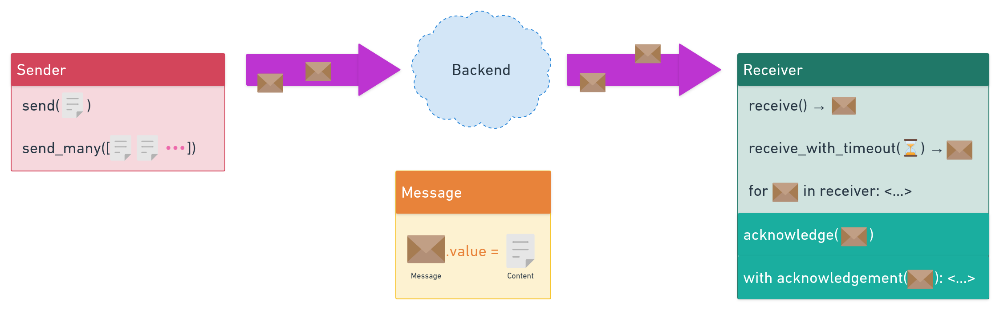

# Queue

[](https://whimsical.com/9FrduJ8TXTaKaQH33Sjiya)

`platonic` views queues as a method of communication between threads, processes, services, and systems with each other. Queue is a one-way communication medium: one system is sending messages, and the other is receiving them.

## Backends

<table>
    <thead>
        <tr>
            <th rowspan="2"></th>
            <th rowspan="2" style="vertical-align: middle">Simple</th>
            <th colspan="2" align="center">
                <a href="/sqs/queue/">SQS</a>
            </th>
        </tr>
        <tr>
            <th>Standard</th>
            <th>FIFO</th>
        </tr>
    </thead>
    <tbody>
        <tr>
            <th>
                <a href="#delivery-guarantees">Delivery Guarantees</a>
            </th>
            <td>=1</td>
            <td>⩾1</td>
            <td>=1</td>
        </tr>
        <tr>
            <th>
                <a href="#order-preservation">Order Preserved</a>
            </th>
            <td>✔</td>
            <td>❌</td>
            <td>✔</td>
        </tr>
        <tr>
            <th colspan="4" align="center">Communicate</th>
        </tr>
        <tr>
            <th>Between Threads</th>
            <td>✔</td>
            <td>✔</td>
            <td>✔</td>
        </tr>
        <tr>
            <th>Between Processes</th>
            <td>❌</td>
            <td>✔</td>
            <td>✔</td>
        </tr>
        <tr>
            <th>Between Machines</th>
            <td>❌</td>
            <td>✔</td>
            <td>✔</td>
        </tr>
    </tbody>
</table>

### Delivery guarantees

| Code | Name          | Definition |
| ---  | ---           | ---        |
| ⩽1   | At most Once  | Messages will not be duplicated, but may be lost.
| =1   | Exactly Once  | Messages will be neither lost nor duplicated. You will receive every distinct message exactly once.
| ⩾1   | At Least Once | Messages will not be lost, but can be duplicated.

[This StackOverflow question](https://stackoverflow.com/q/44204973) has a few good answers explaining these concepts.

### Order preservation

If the backend garantees order, the messages are received in the precise order in which they were sent. For example, if message `M1` was sent before `M2`, you will not receive `M2` first and then `M1`.

If backend is a multi-tenant distributed system, order preservation may require extra effort and cause performance penalty. That is why, say, SQS provides this property as an optional feature for extra pay.

## Python Classes

In a Python program, queue is represented using backend-specific subclasses of `platonic.queue.Receiver` and `platonic.queue.Sender` classes.

!!! note
    You will not use these classes directly if you are not building an implementation for a new backend. Instead, you will typically use backend-specific classes like `platonic.sqs.queue.Receiver` or `platonic.simple.queue.Sender`. Refer to pages of specific backends for details and examples.

## Sender

### `send()` one message

```python
sender.send(Cat(name='Kitty'))
```

The program will block until the message is sent.

### `send_many()` messages

```python
sender.send_many([
    Cat(name='Kitty'),
    Cat(name='Mindy'),
    ...
])
```

Accepts an iterable. Program will block until the iterable is exhausted and all of its values are sent.

## Receiver

### `receive()` new message

```pycon
>>> receiver.receive().value
Cat(name='Tibbles')
```

Will block until a message arrives.

### `receive_with_timeout()`: patience has limits

```pycon
>>> receiver.receive_with_timeout(timeout=30).value
Cat(name='Tibbles')
```

`receive_with_timeout()` will wait for a message from queue during the specified number of seconds. If queue is empty and nothing appears there during that period, you will get an exception raised: `MessageReceiveTimeout`.

### `for message in receiver` iteration

You can just iterate over the `Receiver` object and get all messages one by one. (See below for an example.)

### `acknowledge()` a message

Sometimes, the receiver can receive the message but fail to successfully process it due to whatever reason you can imagine: bug in code, failed database instance, server restart, network glitch.

That is why we require the receiver to **acknowledge** every message it has successfully processed. Like this:

```python
message = receiver.receive()
do_something_with(message.value)
receiver.acknowledge(message)
```

If message is not acknowledged, it will later reappear in the queue for the same (or another) receiver to process it again. That is how queues improve stability of our systems.

### `with acknowledgement()` context manager

Simplifies your client code a bit and makes it more declarative, like this:

```python
message = receiver.receive()

with receiver.acknowledgement(message):
    do_something_with(message.value)
```

Another very often used pattern:

```python
for message in receiver:
    with receiver.acknowledgement(message):
        do_something_with(message.value)
```
